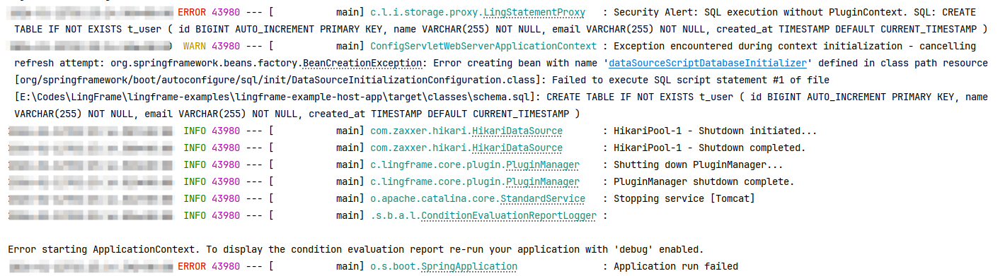

# Getting Started

This guide helps you quickly understand and use LingFrame.

## Prerequisites

- JDK 17+
- Maven 3.8+

## 5-Minute Hello World

### 1. Build Project

**Get Source Code** (Choose any repository):

```bash
# GitHub (International, Recommended)
git clone https://github.com/LingFrame/LingFrame.git

# AtomGit (China)
git clone https://atomgit.com/lingframe/LingFrame.git

# Gitee (China Mirror)
git clone https://gitee.com/knight6236/lingframe.git
```

**Build**:

```bash
cd LingFrame
mvn clean install -DskipTests
```

### 2. Start Example Application

```bash
cd lingframe-examples/lingframe-example-host-app
mvn spring-boot:run
```

### 3. Test Plugin Service

```bash
# Query user list (Provided by user-plugin)
curl http://localhost:8888/user-plugin/user/listUsers

# Query single user
curl "http://localhost:8888/user-plugin/user/queryUser?userId=1"
```

Congratulations! You have successfully run your first LingFrame application!

---

## Core Concepts

### Three-Tier Architecture

```
┌─────────────────────────────────────────┐
│         Core (Governance Kernel)         │
│  Auth Check · Audit · Context Isolation  │
└─────────────────┬───────────────────────┘
                  ▼
┌─────────────────────────────────────────┐
│     Infrastructure (Infra Layer)         │
│       Storage · Cache · Message          │
└─────────────────┬───────────────────────┘
                  ▼
┌─────────────────────────────────────────┐
│       Business (Business Layer)          │
│    User Center · Order Service · Payment │
└─────────────────────────────────────────┘
```

### Key Principles

1. **Zero Trust**: Business modules can only access infrastructure via Core.
2. **Context Isolation**: Each module has an independent Spring Child Context.
3. **FQSID Routing**: Services are identified by global unique `pluginId:serviceId`.

---

## Create Host Application

### 1. Add Dependency

```xml
<dependency>
    <groupId>com.lingframe</groupId>
    <artifactId>lingframe-spring-boot3-starter</artifactId>
    <version>${lingframe.version}</version>
</dependency>
```

### 2. Application Class

```java
@SpringBootApplication
public class HostApplication {
    public static void main(String[] args) {
        SpringApplication.run(HostApplication.class, args);
    }
}
```

### 3. Configuration

Refer to `application.yaml` in the example app:

```yaml
server:
  port: 8888

lingframe:
  enabled: true
  dev-mode: true                    # Dev mode, only warn on permission denied
  
  # Preload Shared API (Supports directory/JAR/wildcard)
  preload-api-jars:
    - lingframe-examples/lingframe-example-order-api
  
  # Plugin Directory
  plugin-home: plugins              # Production: JAR directory
  plugin-roots:                     # Development: Source code directory
    - lingframe-examples/lingframe-example-plugin-order
    - lingframe-examples/lingframe-example-plugin-user
  
  # Host Governance (Optional)
  host-governance:
    enabled: false

# Advanced Feature: Visual Dashboard (Optional, default disabled)
# dashboard:
#   enabled: true
```

### 4. Call Plugin Service in Host

Use `@LingReference` to auto-inject plugin services. LingFrame uses **Consumer-Driven Contracts**:

```java
// Host App (Consumer) defines the interface it needs
// Location: host-api/.../OrderQueryService.java
public interface OrderQueryService {
    List<OrderDTO> findByUserId(Long userId);
}

// Order Plugin (Producer) implements the interface defined by Host
// Location: order-plugin/.../OrderQueryServiceImpl.java
@Component
public class OrderQueryServiceImpl implements OrderQueryService {
    @LingService(id = "find_orders_by_user", desc = "Query User Orders")
    @Override
    public List<OrderDTO> findByUserId(Long userId) {
        return orderRepository.findByUserId(userId);
    }
}

// Host App uses the interface it defined
@RestController
@RequiredArgsConstructor
public class OrderController {

    @LingReference
    private OrderQueryService orderQueryService;  // Framework auto-routes to Order Plugin

    @GetMapping("/orders/user/{userId}")
    public List<OrderDTO> getUserOrders(@PathVariable Long userId) {
        return orderQueryService.findByUserId(userId);
    }
}
```

---

## Example Project Structure

```
lingframe-examples/
├── lingframe-example-host-app        # Host Application
├── lingframe-example-order-api       # Shared API (Interface defined by Consumer)
├── lingframe-example-plugin-order    # Order Module
└── lingframe-example-plugin-user     # User Module (Provides /user/* API)
```

## Create Business Module

See [Module Development Guide](plugin-development.md)

## Security Governance Demo (Killer Feature)

The example project has built-in governance policies. You can experience LingFrame's core **Zero Trust Governance** via the following steps.

### 1. Attempt Illegal Write (SQL Interception)

User Plugin declared `READ` permission for database in `plugin.yml`, but did NOT declare `WRITE` permission.

Call Create User API (Executes INSERT SQL):

```bash
curl -X POST "http://localhost:8888/user-plugin/user/createUser?name=Attacker&email=hacker@test.com"
```

**Expected Result**:
- HTTP 500 Internal Server Error
- Observe exception in console log:

```text
c.l.core.exception.PermissionDeniedException: Plugin [user-plugin] requires [storage:sql] with [WRITE] access, but only allowed: [READ]
```

### 2. Experience Cache Acceleration (Cache Proxy)

User Plugin declared `WRITE` permission for `cache:local`.

**First Query** (Trigger SQL query and write to cache):

```bash
curl "http://localhost:8888/user-plugin/user/queryUser?userId=1"
```

Observe Log:
```text
Executing SQL: SELECT * FROM t_user WHERE id = ?
Cache PUT: users::1
Audit: Plugin [user-plugin] accessed [storage:sql] (ALLOWED)
```

**Second Query** (Cache Hit, No SQL):

```bash
curl "http://localhost:8888/user-plugin/user/queryUser?userId=1"
```

Observe Log:
```text
Cache HIT: users::1
Audit: Plugin [user-plugin] accessed [cache:local] (ALLOWED)
```

### 3. [Real World Case] Host Initialization Intercepted?

In early versions, LingFrame's security policy was so strict that it even intercepted Spring Boot's startup SQL initialization script (`schema.sql`), throwing `Security Alert: SQL execution without PluginContext...`. This proves the **no-blind-spot coverage** of the governance kernel—even I/O operations during framework startup cannot escape it.



> Current versions check if host governance is enabled to ensure developer experience.

---

## Next Steps

- [Module Development Guide](plugin-development.md) - Learn how to develop business modules
- [Shared API Guidelines](shared-api-guidelines.md) - API Design Best Practices
- [Dashboard Visual Governance](dashboard.md) - Advanced Optional Feature
- [Architecture Design](architecture.md) - Deep dive into governance principles
