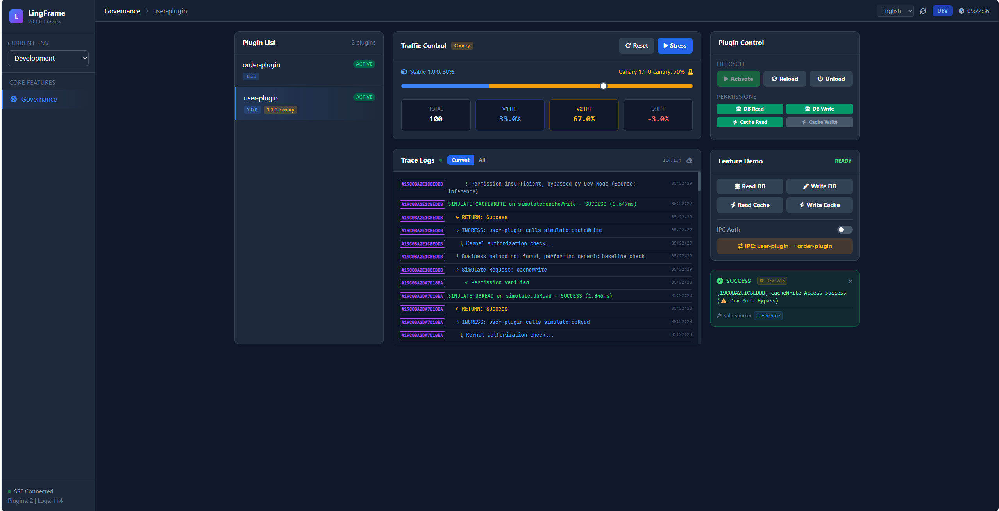

# LingFrame（灵珑）

**为 Spring Boot 提供插件化架构与不停机灰度发布的 JVM 运行时框架**
*在此之上，内建完整的权限控制与安全审计能力*


[](../../pulls)

---

## 🚑 LingFrame 能立刻帮你解决什么？

> **不改整体架构，也能让系统更安全地上线新功能**

* ✅ **插件化拆分业务模块**，不稳定功能与核心系统隔离
* 🚦 **不停机灰度 / 金丝雀发布**，新功能只对部分用户生效
* 🔁 **快速回滚**，插件级别启停，无需重新发版
* 🧵 **全链路追踪与审计日志**，问题可定位、责任可追溯

> LingFrame 不是用来“设计得更优雅”，
> 而是用来**让系统少炸、可控、能活下来**。

---

## 🧩 插件化 Spring Boot（核心能力）

LingFrame 将 **完整的 Spring Boot 上下文** 作为插件运行：

* 每个插件拥有独立 ClassLoader
* 独立生命周期（加载 / 启动 / 停止 / 卸载）
* 可按需启用、禁用、替换
* 不需要拆成微服务，也不引入网络开销

**你可以把它理解为：**

> 👉「**可热插拔的 Spring Boot 模块**」

### 典型用途

* 把 **实验性 / 高风险功能** 放进插件
* 把 **第三方 / 二次开发代码** 与主系统隔离
* 把 **低频功能** 按需加载，降低系统复杂度

---

## 🚦 不停机灰度发布 / 金丝雀能力

LingFrame 内建插件级流量控制能力：

* 插件实例池
* 灰度 / 金丝雀发布
* 标签路由
* 插件版本并存

你可以做到：

* 新插件 **只对 5% 用户生效**
* 出问题 **立刻回滚到旧插件**
* 整个过程 **无需重启应用**

> 对开发和运维来说，这是**保命能力**。

---

## 🧵 全链路追踪与调用审计（默认开启）

LingFrame 会记录：

* 插件 → 插件
* 插件 → 基础设施（DB / Cache / MQ）
* 插件 → 宿主应用

每一次跨模块调用，都会留下：

* 调用来源
* 调用目标
* 执行耗时
* 权限判定结果
* 审计日志

> 出问题时，你不再靠猜。

---

## 🛡️ 进阶能力：运行时治理（长期价值）

当系统规模和复杂度上升后，LingFrame 提供完整的**治理内核**：

* 🔐 **权限控制**：所有跨模块调用必须经过鉴权
* ⚖️ **能力仲裁**：Core 作为唯一调用代理，禁止绕过
* 🧾 **安全审计**：满足合规、风控、事后追责需求
* 🔒 **零信任模型**：插件默认不可信

> 这些能力不是第一次使用的理由，
> 但会在系统变复杂时，**救你一命**。

---

## 🧠 核心理念：先活下来，再建立秩序

```text
┌───────────────────────────────────────────────┐
│            Core（治理与运行时内核）             │
│   权限 · 审计 · 调用仲裁 · 链路追踪             │
└───────────────────────┬───────────────────────┘
                        ▼
┌───────────────────────────────────────────────┐
│          Infrastructure（基础设施代理）        │
│     DB / Cache / MQ / Search 统一受控          │
└───────────────────────┬───────────────────────┘
                        ▼
┌───────────────────────────────────────────────┐
│           Business Plugins（业务插件）          │
│      可灰度 · 可回滚 · 可隔离                   │
└───────────────────────────────────────────────┘
```

---

## 🚀 5 分钟上手（最短路径）

### 环境要求

* Java 21+
* Maven 3.8+

### 启动宿主应用

```bash
git clone https://github.com/lingframe/lingframe.git
cd lingframe
mvn clean install -DskipTests

cd lingframe-examples/lingframe-example-host-app
mvn spring-boot:run
```

### 启用插件机制

```yaml
lingframe:
  enabled: true
  dev-mode: true
  plugin-home: "plugins"
  auto-scan: true
```


*图示：插件管理面板，展示实时状态、灰度流量和审计日志。*

---

## 🧩 创建你的第一个插件

### 定义接口（消费者驱动）

```java
public interface UserQueryService {
    Optional<UserDTO> findById(String userId);
}
```

### 插件实现

```java
@SpringBootApplication
public class UserPlugin implements LingPlugin {

    @Override
    public void onStart(PluginContext context) {
        System.out.println("User plugin started");
    }
}

@Component
public class UserQueryServiceImpl implements UserQueryService {

    @LingService(id = "find_user")
    @Override
    public Optional<UserDTO> findById(String userId) {
        return repository.findById(userId);
    }
}
```

### 插件元数据

```yaml
id: user-plugin
version: 1.0.0
description: User module
mainClass: com.example.UserPlugin
```

---

## 🔄 跨插件调用（自动治理）

```java
@Component
public class OrderService {

    @LingReference
    private UserQueryService userQueryService;

    public Order create(String userId) {
        return userQueryService.findById(userId)
            .map(Order::new)
            .orElseThrow();
    }
}
```

> 所有调用都会自动经过：
> 权限校验 · 审计 · 链路追踪 · 路由决策

---

## 👤 适合谁使用？

* 想要 **插件化改造单体应用** 的团队
* 需要 **不停机发布 / 灰度能力** 的系统
* 有 **二次开发 / 第三方扩展** 需求的平台
* 系统开始变复杂，但还不想上微服务

---

## 📦 项目结构

```text
lingframe/
├── lingframe-api
├── lingframe-core
├── lingframe-runtime
├── lingframe-infrastructure
├── lingframe-examples
├── lingframe-dependencies
└── lingframe-bom
```

---

## 🤝 参与贡献

* 功能开发
* 示例完善
* 文档补充
* 架构讨论

👉 查看 [Issues](../../issues) / [Discussions](../../discussions)

---

## 📄 License

Apache License 2.0

---

### 最后一句（刻意留下的）

> **LingFrame 不要求你一开始就“治理一切”。**
> **它只是让你在系统失控之前，多一次选择的机会。**
